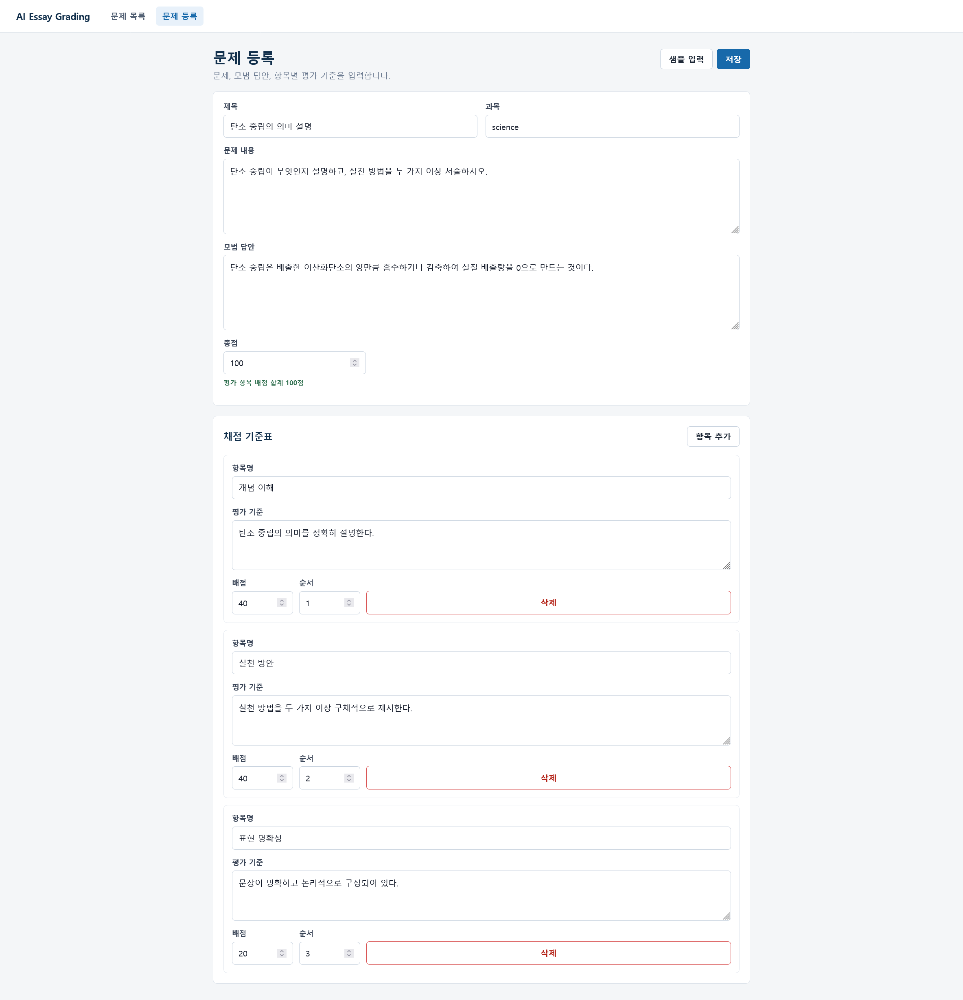
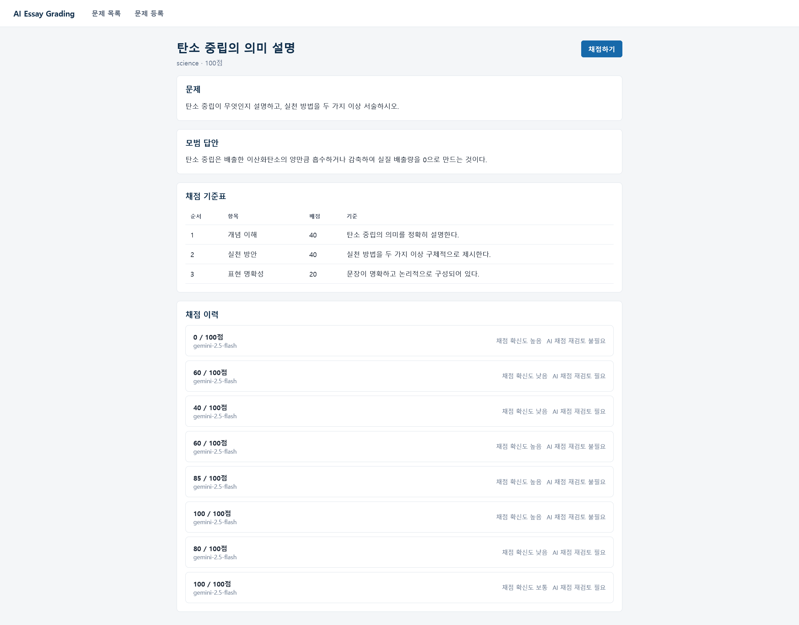
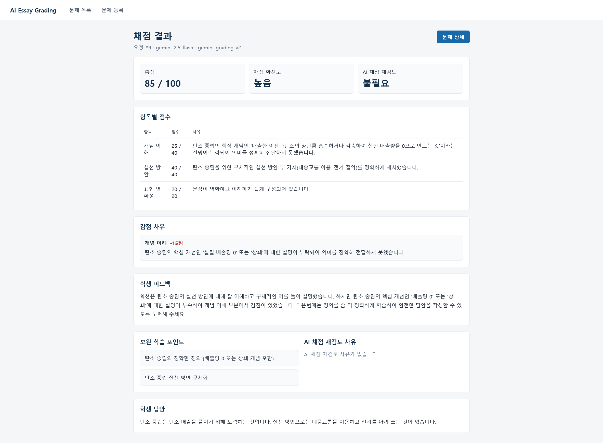

# AI Essay Grading Prototype

AI Essay Grading Prototype은 LLM API로 서술형 답안을 채점하고, 결과를 구조화된 JSON으로 저장·검증·시각화하는 AI 에듀테크 포트폴리오 프로젝트입니다.

단순한 LLM API 호출 예제가 아니라 문제 등록, rubric 관리, 학생 답안 제출, AI 채점, 항목별 점수, 감점 사유, 피드백, 재검토 플래그, 채점 이력까지 이어지는 서비스형 흐름을 다룹니다.

## 프로젝트 목적

- 문제와 평가 기준을 등록하고 학생 답안을 채점하는 흐름을 end-to-end로 구현합니다.
- Gemini API Provider로 실제 LLM 채점 요청과 응답을 처리합니다.
- Mock LLM Provider로 외부 API 없이도 로컬 흐름을 확인할 수 있습니다.
- LLM 호출 인터페이스를 분리해 Gemini와 Mock Provider를 설정으로 선택합니다.
- 채점 결과 JSON, 모델명, 프롬프트 버전명을 함께 저장해 추적 가능성을 확보합니다.
- 백엔드, 프론트엔드, 데이터베이스, 로컬 인프라를 연결한 풀스택 예제로 구성합니다.

## 주요 기능

- 문제와 rubric 생성
- 문제 목록 및 상세 조회
- 학생 답안 채점 요청
- Gemini API 기반 구조화된 채점 결과 생성
- Mock Provider 기반 오프라인 채점 결과 생성
- 채점 결과 검증 후 DB 저장
- 총점, 항목별 점수, 감점 사유, 피드백, 보완 학습 포인트 표시
- 재검토 필요 여부와 재검토 사유 표시
- 문제별 채점 이력 조회

## 화면 미리보기

### 문제 등록



### 문제 상세 및 채점 이력



### 채점 결과



## 기술 스택

| 영역 | 기술 |
| --- | --- |
| Frontend | React, TypeScript, Vite, Axios, React Router |
| Backend | Kotlin, Spring Boot, Spring Web, Spring Data JPA, Validation |
| API Docs | Springdoc OpenAPI, Swagger UI |
| Database | PostgreSQL 16 |
| Local Infra | Docker Compose |
| LLM | Gemini API Provider, Mock Provider |

## 아키텍처

```text
React + TypeScript + Vite
        |
        | REST API
        v
Kotlin + Spring Boot
        |
        | Spring Data JPA
        v
PostgreSQL 16

GradingService
        |
        v
GradingAiClient
        |
        +-- MockGradingAiClient
        +-- GeminiGradingAiClient
```

백엔드는 `GradingAiClient` 인터페이스 뒤에 채점 Provider를 둡니다. `LLM_PROVIDER=gemini`와 `GEMINI_API_KEY`를 설정하면 Gemini API로 실제 채점을 요청하고, `LLM_PROVIDER`가 없으면 `mock`을 기본값으로 사용합니다.

Gemini Provider는 `generateContent` API에 JSON 응답 schema를 전달하고, 응답을 `GradingAiResponse`로 변환합니다. 백엔드는 변환된 결과를 `GradingResultValidator`로 검증한 뒤 저장합니다.

## 로컬 실행 방법

### PostgreSQL 실행

로컬 DB는 Docker Compose로 실행한 PostgreSQL 16을 사용합니다.

```bash
docker compose up -d postgres
```

### Backend 실행

```bash
cd backend
LLM_PROVIDER=gemini GEMINI_API_KEY="your-gemini-api-key" GEMINI_MODEL=gemini-2.5-flash GEMINI_TIMEOUT_SECONDS=60 ./gradlew bootRun
```

외부 API 없이 Mock Provider로 실행할 때는 다음 명령을 사용합니다.

```bash
cd backend
LLM_PROVIDER=mock ./gradlew bootRun
```

기본 DB 연결 정보:

- URL: `jdbc:postgresql://localhost:5432/essay_grading`
- Username: `essay_grading_user`
- Password: `essay_grading_password`

### Frontend 실행

```bash
cd frontend
npm install
npm run dev
```

### 접속 URL

- Frontend: http://localhost:5173
- Backend: http://localhost:8080
- Swagger: http://localhost:8080/swagger-ui.html
- OpenAPI JSON: http://localhost:8080/v3/api-docs
- PostgreSQL: localhost:5432

### 검증 명령

```bash
cd backend
./gradlew test
./gradlew ktlintCheck

cd ../frontend
npm run build
```

## API 문서

백엔드 실행 후 Swagger UI에서 API를 확인할 수 있습니다.

- http://localhost:8080/swagger-ui.html
- http://localhost:8080/swagger-ui/index.html

주요 API:

| 기능 | Method | Path |
| --- | --- | --- |
| 문제 생성 | POST | `/api/questions` |
| 문제 목록 조회 | GET | `/api/questions` |
| 문제 상세 조회 | GET | `/api/questions/{questionId}` |
| 채점 요청 | POST | `/api/grading-requests` |
| 채점 결과 상세 조회 | GET | `/api/grading-results/{gradingResultId}` |
| 문제별 채점 이력 조회 | GET | `/api/grading-results?questionId={questionId}` |

## 샘플 시나리오

1. Swagger 또는 프론트엔드에서 문제와 rubric을 등록합니다.
2. 문제 상세 화면에서 채점하기를 선택합니다.
3. 학생 답안을 입력하고 채점 요청을 보냅니다.
4. 채점 결과 화면에서 총점, 항목별 점수, 감점 사유, 피드백, 재검토 여부를 확인합니다.
5. 문제 상세 화면에서 채점 이력을 다시 확인합니다.

Swagger에서 바로 확인하려면 먼저 `POST /api/questions`에 다음 요청을 보냅니다.

```json
{
  "title": "탄소 중립의 의미 설명",
  "subject": "science",
  "content": "탄소 중립이 무엇인지 설명하고, 실천 방법을 두 가지 이상 서술하시오.",
  "modelAnswer": "탄소 중립은 배출한 이산화탄소의 양만큼 흡수하거나 감축하여 실질 배출량을 0으로 만드는 것이다.",
  "totalScore": 100,
  "rubricItems": [
    {
      "name": "개념 이해",
      "criteria": "탄소 중립의 의미를 정확히 설명한다.",
      "maxScore": 40,
      "sortOrder": 1
    },
    {
      "name": "실천 방안",
      "criteria": "실천 방법을 두 가지 이상 구체적으로 제시한다.",
      "maxScore": 40,
      "sortOrder": 2
    },
    {
      "name": "표현 명확성",
      "criteria": "문장이 명확하고 논리적으로 구성되어 있다.",
      "maxScore": 20,
      "sortOrder": 3
    }
  ]
}
```

응답의 `id`를 `questionId`로 사용해 `POST /api/grading-requests`에 채점 요청을 보냅니다.

```json
{
  "questionId": 1,
  "studentAnswer": "탄소 중립은 이산화탄소를 아예 배출하지 않는 것입니다. 실천 방법으로는 대중교통 이용과 전기 절약이 있습니다."
}
```

## LLM Provider 전략

현재 제공하는 Provider는 다음과 같습니다.

- `GeminiGradingAiClient`: Gemini `generateContent` API를 호출해 구조화된 채점 JSON을 받습니다.
- `MockGradingAiClient`: 외부 API 없이 고정 규칙 기반 채점 결과를 반환합니다.

Gemini 응답은 모델 출력 그대로 저장하지 않습니다. 등록된 rubric 기준으로 점수와 감점 항목을 보정하고, 백엔드 검증을 통과한 결과만 저장합니다. 실패한 채점 요청은 `grading_requests`에 `FAILED` 상태와 오류 메시지를 남깁니다.

## DB 설계 요약

- `questions`: 문제 본문, 모범 답안, 총점
- `rubric_items`: 문제별 평가 항목과 배점
- `grading_requests`: 학생 답안과 채점 처리 상태
- `grading_results`: 채점 결과 JSON, 모델명, 프롬프트 버전명, 총점, 재검토 여부

## 문서

- [아키텍처](docs/architecture.md)
- [API 설계](docs/api-design.md)
- [DB 설계](docs/db-design.md)
- [프롬프트 설계](docs/prompt-design.md)
- [개발 기록](docs/development-plan.md)
- [배포 참고](docs/deployment-plan.md)

## 마무리 개선 범위

- 오개념이 포함된 답안의 감점 기준 보강
- `reviewRequired`와 rubric 점수의 정합성 개선
- Gemini 응답 품질을 높이기 위한 프롬프트 문구 조정

## 강조 역량

- Kotlin/Spring Boot 기반 REST API 설계와 검증
- JPA Entity와 API DTO 분리
- LLM Provider 추상화와 Gemini API 연동
- 구조화 JSON 저장과 검증 로직 구현
- React/TypeScript 기반 API 연동 화면 구현
- Docker Compose 기반 로컬 개발 환경 구성
